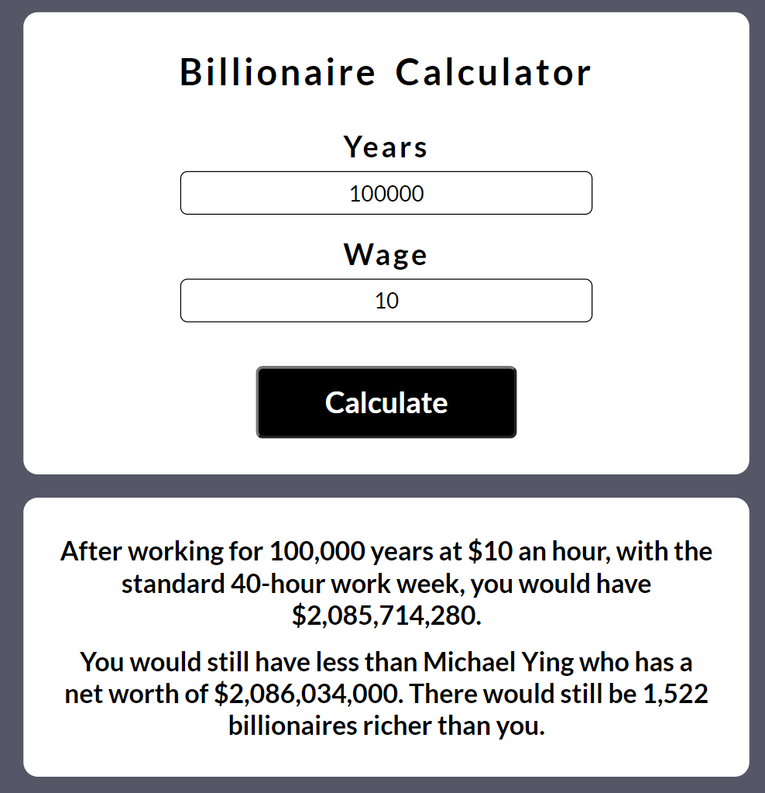

# Billionaire Calculator

 

This website allows the user to enter a number of years and an hourly wage. Those inputs will then be used to calculate their wealth which will be determined using the following equation: wealth = *wage* × 40 hours × 52 weeks × *years*. **NOTE:** This equation doesn't consider spending, taxes, investments, etc. 

Once the user's wealth is calculated, their wealth will be compared to all of the billionaires that exist at the time of calculation. If the user's wealth is greater than $1 billion but less than the net worth of the richest person, then the user will be shown how their net worth compares to the billionaire directly above them in the billionaire net worth rankings; also, they will be shown how many billionaires would still be richer than them. If the user's wealth is less than $1 billion or greater than the net worth of the richest person, then the user will not be compared to any billionaires. 

Wealth inequality continues to get worse with each passing year. The rich get richer and the poor get poorer. This website is an attempt of mine to depict the astronomical gap that exists today between billionaires and the working class.
